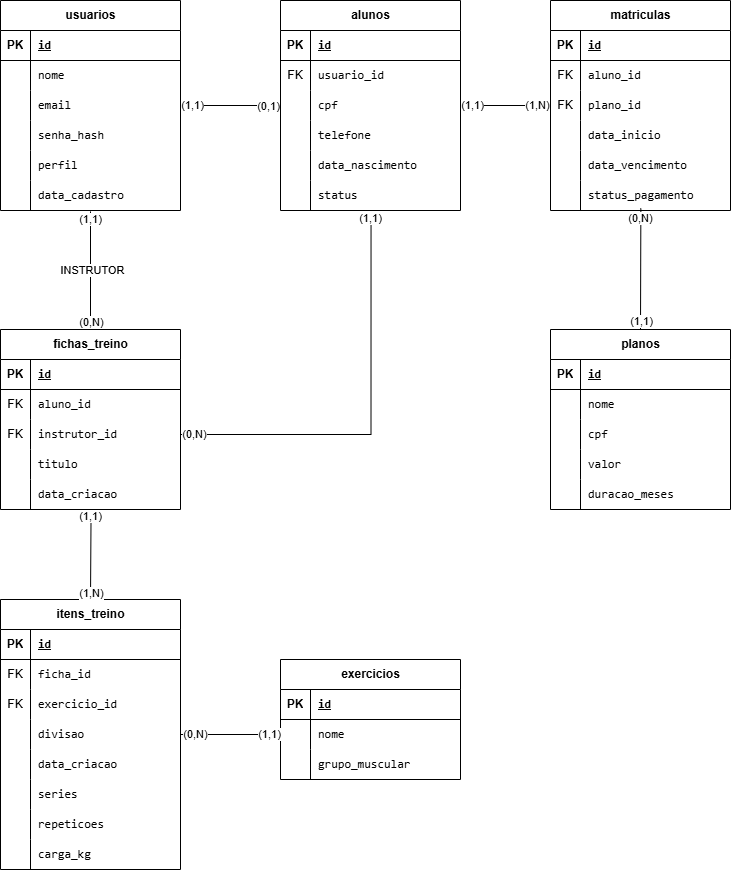

**Tecnólogo em Análise e Desenvolvimento de Sistemas**

**Disciplina:** Projeto e Implementação de Sistemas para Web 2

**Docente:** Prof. Pedro Henrique Neves da Silva

**Projeto:** GymCore Web – Sistema Web de Gestão de Academia

**Discentes / Dupla:**

*   Tiago Lopes de Andrade (Turma: Juazeiro II)
*   Italo Lopes de Andrade (Turma: Sobradinho)

**1\. DESCRIÇÃO DO PROJETO2**

**2\. OBJETIVOS E PÚBLICO-ALVO 2**

2.1. Objetivo Geral2

2.2. Objetivos Específicos2

2.2. Público-Alvo2

**3\. FUNCIONALIDADES PREVISTAS 3**

3.1. Módulo 1: Autenticação e Controle de Acesso3

3.2. Módulo 2: Gestão de Alunos e Usuários3

3.3. Módulo 3: Planos e Financeiro3

3.4. Módulo 4: Prescrição e Gestão de Treinos3

3.5. Módulo 5: Dashboard e Relatórios3

**4\. DIAGRAMA DE ENTIDADE-RELACIONAMENTO (DER)4**

4.1. Entidades e Atributo4

4.2. Público-Alvo4

**5\. PROTÓTIPOS DAS TELAS (WIREFRAMES)5**

**6\. REPOSITÓRIO GITHUB E ESTRUTURA DE ARQUIVOS6**

1.  **Descrição do Projeto**

O **GymCore Web** é uma aplicação web voltada para a automação e centralização da gestão operacional, financeira e instrutiva de academias de ginástica e centros de treinamento.

O sistema resolverá o problema da dispersão de informações (muitas vezes mantidas em planilhas ou fichas de papel), permitindo o controle digital de matrículas, gestão de planos e mensalidades, além da montagem de fichas de treinos personalizadas para cada aluno.

A arquitetura do sistema utilizará o padrão MVC/DAO em PHP 8, garantindo persistência segura de dados com MySQL e PDO (Prepared Statements) contra ataques como SQL Injection, e uma interface responsiva baseada em HTML5, CSS3 e Javascript.

1.  **Objetivos e Público-Alvo**

Objetivo Geral:

*   Desenvolver uma plataforma web capaz de gerenciar o fluxo de alunos, matrículas, pagamentos e prescrição de treinos de uma academia de forma ágil e segura.

Objetivos Específicos:

*   Implementar controle de acesso baseado em níveis de usuário (Administrador, Instrutor/Personal, Aluno);
*   Desenvolver o módulo de cadastro e manutenção de alunos e seus respectivos status de adimplência;
*   Criar a funcionalidade de prescrição de treinos digitais (fichas com séries, repetições e exercícios);
*   Automatizar a gestão de planos (Mensal, Trimestral, Anual) e acompanhamento de vencimentos;
*   Aplicar padrões modernos de desenvolvimento Web (POO, arquitetura DAO e segurança com PDO).

Público-Alvo:

1.  **Administradores / Recepcionistas:** Responsáveis por matricular alunos, receber pagamentos, alterar planos e acompanhar métricas da academia.
2.  **Instrutores / Personal Trainers:** Responsáveis pela criação, montagem e atualização das fichas de treinos dos alunos.
3.  **Alunos:** Usuários finais que acessam o sistema para visualizar seus treinos ativos, histórico de treinos e status da assinatura.
4.  **Funcionalidade Previstas**

Módulo 1: Autenticação e Controle de Acesso:

*   Login seguro com verificação de perfil (Admin, Instrutor, Aluno);
*   Criptografia de senhas (usando password\_hash do PHP);
*   Encerramento seguro de sessão (Logout).

Módulo 2: Gestão de Alunos e Usuários:

*   CRUD (Criar, Ler, Atualizar, Deletar) de Usuários do sistema;
*   Cadastro completo de Aluno (Dados pessoais, CPF, telefone, data de nascimento, foto);
*   Alteração de status do aluno (Ativo, Inativo, Pendente)

Módulo 3: Planos e Financeiro:

*   Cadastro de Planos (Ex: Plano Mensal R$ 100, Plano Anual R$ 80/mês);
*   Vinculação de Aluno a um Plano (Geração da Matrícula);
*   Registro e controle de pagamentos / data de vencimento.

Módulo 4: Prescrição e Gestão de Treinos:

*   Cadastro de catálogo de Exercícios (Ex: Supino Reto, Agachamento, Puxada Alta) categorizados por grupo muscular;
*   Criação de Fichas de Treino vinculadas a um Aluno e criadas por um Instrutor;
*   Definição de Séries, Carga (kg), Repetições e Dias da Semana (Treino A, B, C).

Módulo 5: Dashboard e Relatórios:

*   Painel administrativo com total de alunos ativos, mensalidades a vencer no mês e treinos cadastrados;
*   Painel do Aluno para consulta ágil do treino do dia via celular.

1.  **Estrutura para o DER (Diagrama de Entidade-Relacionamento)**

1.  **Protótipos das Telas (Wireframes)**

**Fazer\*\***

1.  **Repositório GitHub**

Link do Repositório (Tiago Lopes): [https://github.com/tiagolopes-ads/GymCore-Web-.git](https://github.com/tiagolopes-ads/GymCore-Web-.git)

Link do Repositório (Italo Lopes):
